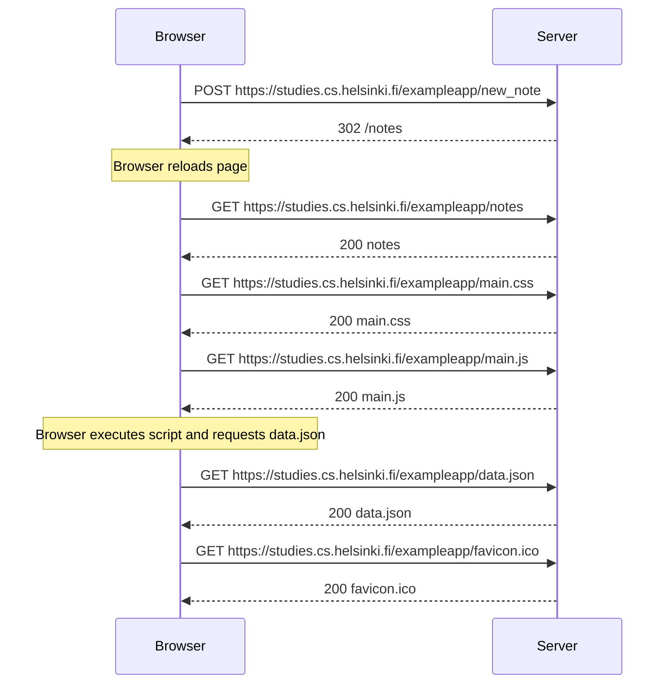

```mermaid
sequenceDiagram
Browser ->> Server: POST https://studies.cs.helsinki.fi/exampleapp/new_note
Server -->> Browser: 302 /notes
Note over Browser: Browser reloads page
Browser ->> Server: GET https://studies.cs.helsinki.fi/exampleapp/notes
Server -->> Browser: 200 notes
Browser ->> Server: GET https://studies.cs.helsinki.fi/exampleapp/main.css
Server -->> Browser: 200 main.css
Browser ->> Server: GET https://studies.cs.helsinki.fi/exampleapp/main.js
Server -->> Browser: 200 main.js
Note over Browser: Browser executes script and requests data.json
Browser ->> Server: GET https://studies.cs.helsinki.fi/exampleapp/data.json
Server -->> Browser: 200 data.json
Browser ->> Server: GET https://studies.cs.helsinki.fi/exampleapp/favicon.ico
Server -->> Browser: 200 favicon.ico
```
